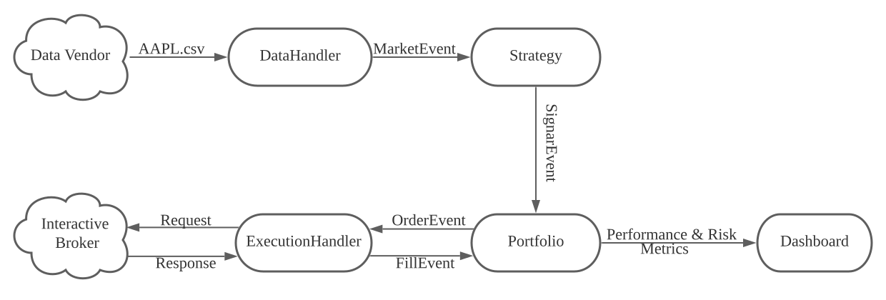

# Project Proposal

*Chuang Yao, Jianqi Zhu, Kongjun Qin*

We will be developing an event-driven backtesting library (HackTest) as the course project for OOP I. HackTest will be a library inspired by [a series of articles](https://www.quantstart.com/articles/Event-Driven-Backtesting-with-Python-Part-I/) on [QuantStart](https://quantstart.com/) about event-driven backtesting with Python. It will be written in C++ with the following in mind:

- object-oriented approach & code reusability
- high performance & low latency
- supporting a wide variety of order types
- realistic emulation of market transactions
- capable of handling real-time market data
- performance and risk management metrics

The library will likely function as illustrated bellow:

For now, we will focus on backtesting on historical data and assume price data have already been downloaded from data vendors as CSV files. 

Based on the market data, `DataHandler` will emit a `MarketEvent` object to the `Strategy` object. The `Strategy` class is implemented by library users and can be customized to reflect their trading strategies. Upon receiving the `MarketEvent`, it will process the data and emit a `SignalEvent` to `Portfolio` with instructions on how to adjust current positions. Then `Potfolio` will send an `OrderEvent` to `ExecutionHandler` on what to buy and what to sell. `FillEvent` contains feedback to the `Portfolio` about the transaction costs and the details of orders filled from the broker. The `Dashboard` will be updated with real-time performance and risk management metrics. 

